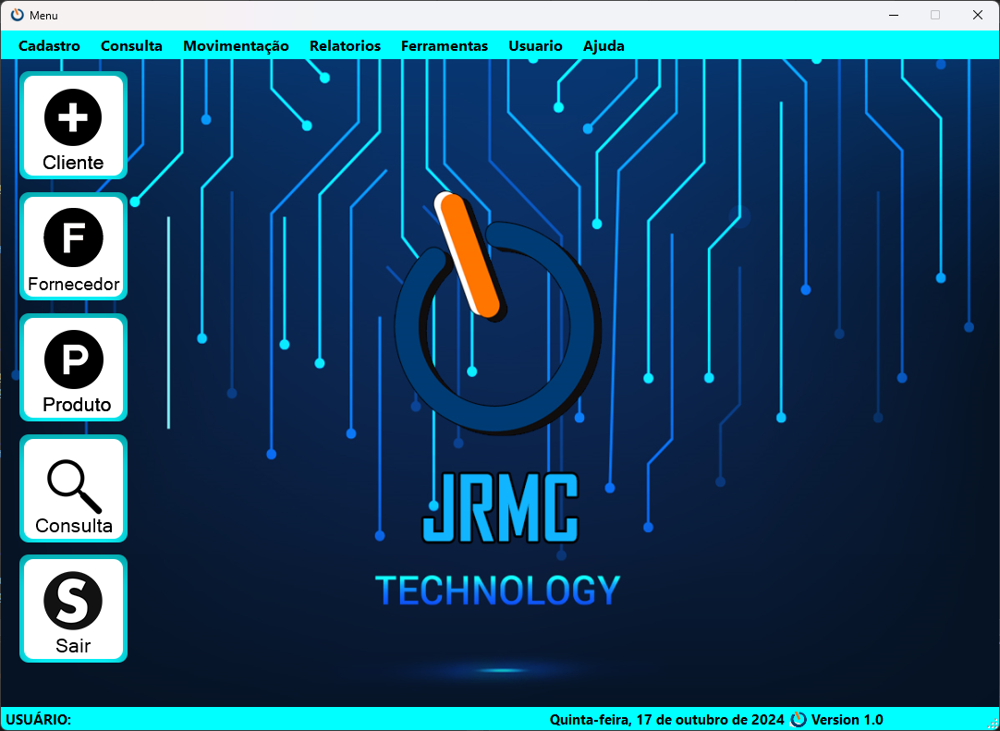
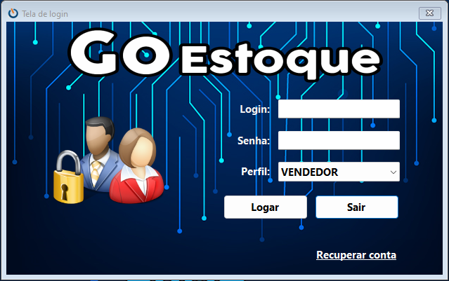
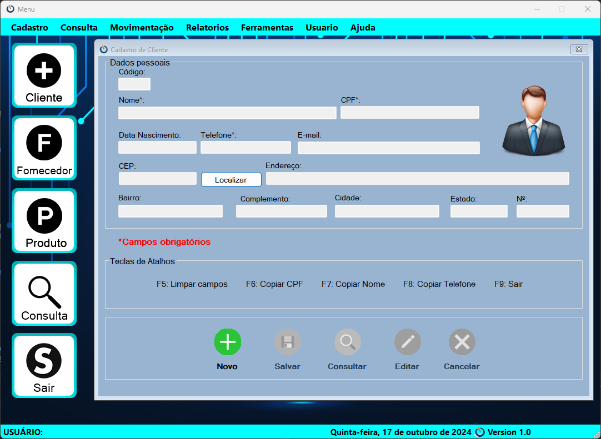
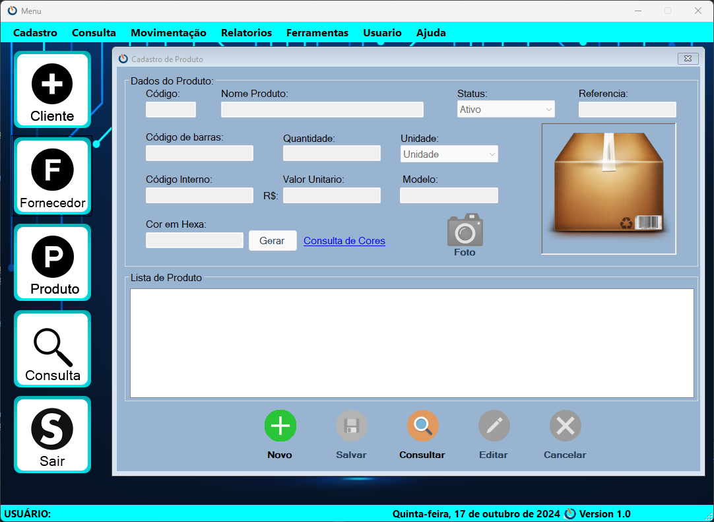
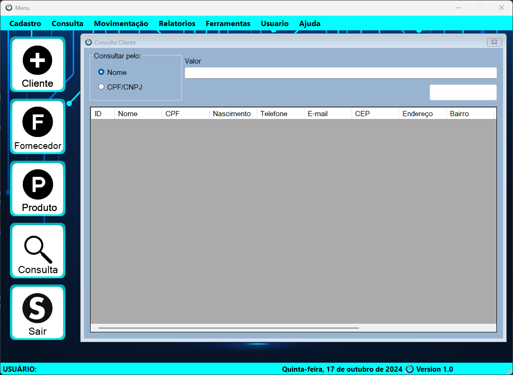
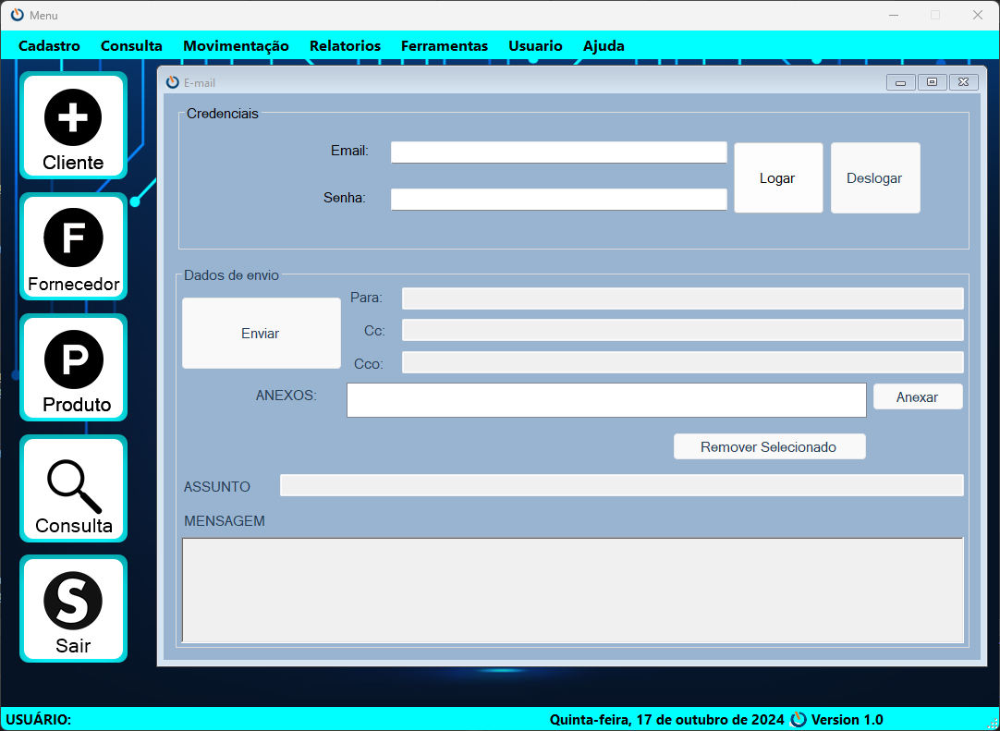
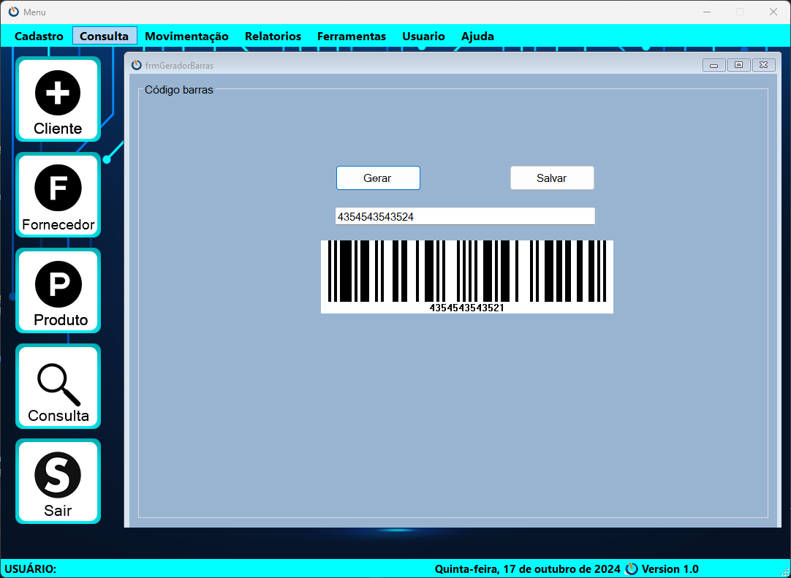
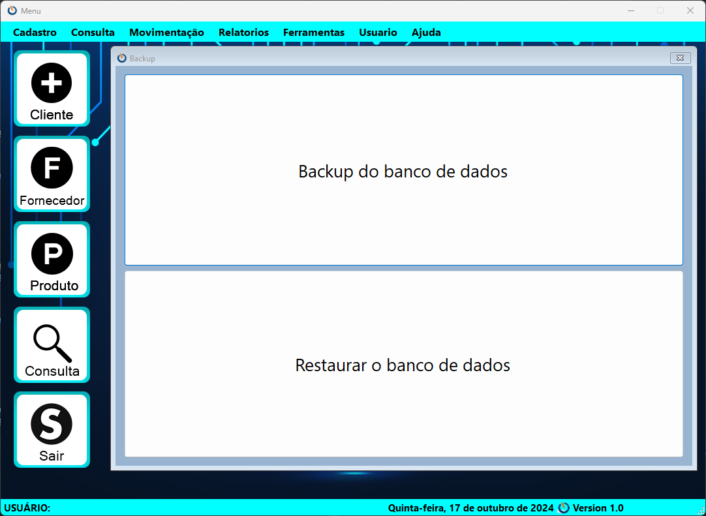
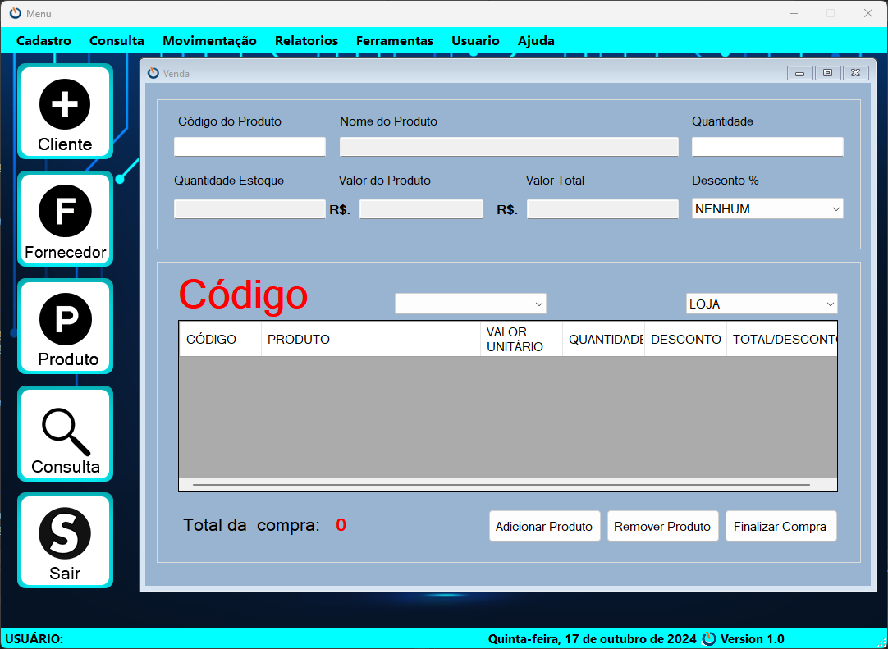

# GoSys

## Sobre o Projeto

**GoSys** é um sistema de gestão desenvolvido em C# com banco de dados SQL Server, projetado para facilitar o gerenciamento de clientes, fornecedores, produtos e vendas. Este sistema também oferece funcionalidades como envio de e-mails e geração de códigos de barras.

## Funcionalidades

- Cadastro de clientes
- Cadastro de fornecedores
- Cadastro de produtos
- Consulta de clientes
- Envio de e-mails
- Geração de códigos de barras
- Controle de vendas

Tecnologias Utilizadas
C# - Linguagem de programação principal.
SQL Server - Banco de dados utilizado para armazenar as informações.
iTextSharp - Biblioteca para geração de PDFs.

## Imagens do Sistema

### Tela de Menu



### Tela de Login



### Tela de Cadastro de Clientes



### Tela de Cadastro de Produtos



### Tela de Consulta de Clientes



### Tela de Envio de E-mail



### Geração de Código de Barras



### Backup



### Tela de Vendas



## Como Executar o Projeto

Para executar este projeto no seu ambiente local, siga os passos abaixo:

### 1. Clone o repositório

```bash
git clone https://github.com/clayton-oly/GoEstoqueSys.git
